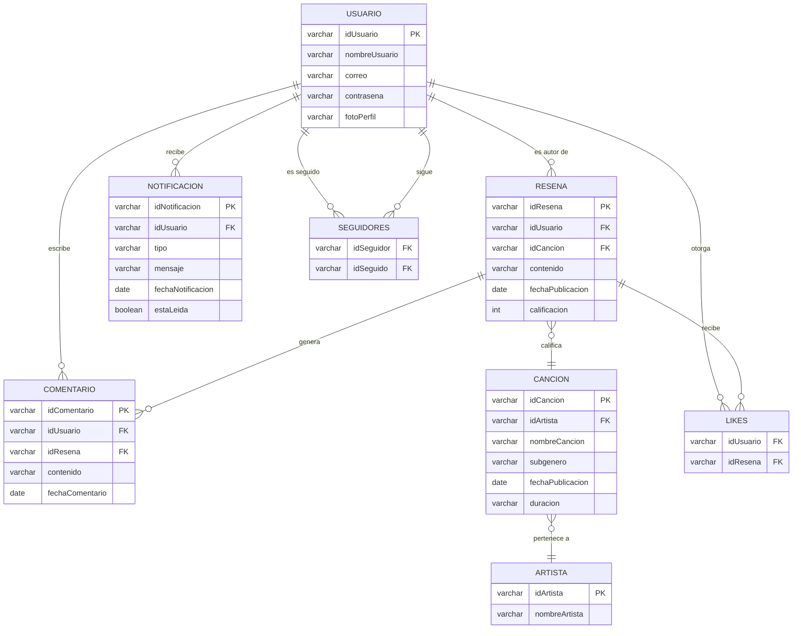
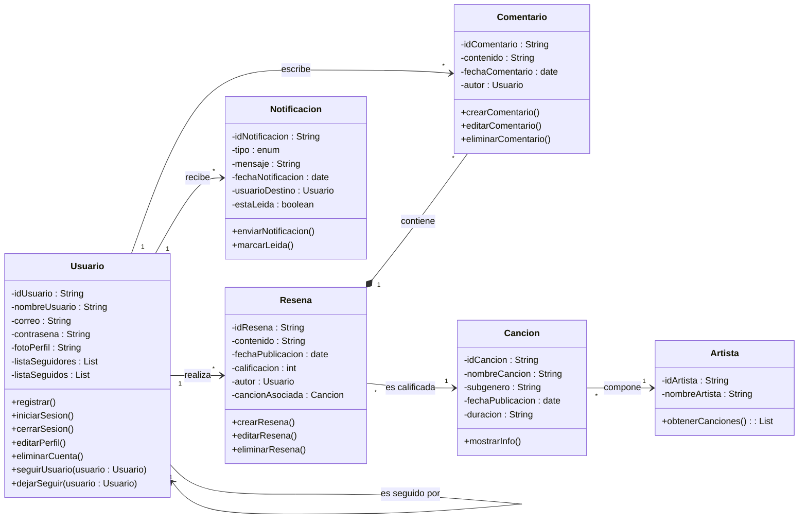

# SOY ( Song Of The Year)

**SOY** es una aplicación móvil desarrollada en la clase de Computación Móvil con el propósito de aplicar los conceptos y requisitos vistos en el curso mediante la creación de una red social enfocada en la música. La app permite a los usuarios registrarse, autenticarse y gestionar su cuenta, descubrir canciones, visualizar su información principal, calificarlas en una escala del 0 al 5, escribir reseñas y comentarios, interactuar con otros usuarios mediante “likes” y seguimientos, recibir notificaciones por actividades relevantes y explorar un feed personalizado con las publicaciones más recientes, además de contar con búsqueda y filtrado de canciones y un perfil donde cada usuario puede administrar su foto y ver sus calificaciones, integrando así funcionalidades de interacción, gestión de datos y diseño de interfaces móviles.

## Tecnologias

-Kotlin

-Figma

## Funcionalidades

- Registro, inicio de sesión, cierre de sesión.

- Eliminación definitiva de cuenta.

- Visualización de información detallada de canciones (nombre, artista, género, fecha, duración, comentarios y reseñas).

- Calificación de canciones en escala de 0 a 5 (una por canción, editable).

- Creación, edición y eliminación de reseñas y comentarios.

- Sistema de seguimiento entre usuarios.

- Feed principal con publicaciones ordenadas por fecha (más recientes primero).

- Interacción mediante comentarios y likes en publicaciones.

- Pantalla de canciones recientes.

- Búsqueda por nombre y filtrado por categoría.

- Perfil de usuario con listado de canciones calificadas y edición de foto.

- Notificaciones por nuevos seguidores, comentarios y “likes”.

## Mockup ( FIGMA)
https://lapel-mule-60435246.figma.site    
## 📊 Diagrama de Clases

## Paleta de colores
#110126 → color Azul intenso 

#041b61 → color Azul marino

#002cb1 → color Azul real

#005cc1 → color Azul medio

#008bf2 → color Azul claro

#9e55fa → color Violeta claro

#af34dd → color Púrpura

#8e19b8 → color Morado

#81005c → color Magenta oscuro

#400116 → color Burdeos

## Diagrama E/R

## 🗄️ Diagrama de clases

### Integrantes

Jose Medina - 
Eliana Pardo - 
Juan Suarez - 
Laura Lara
