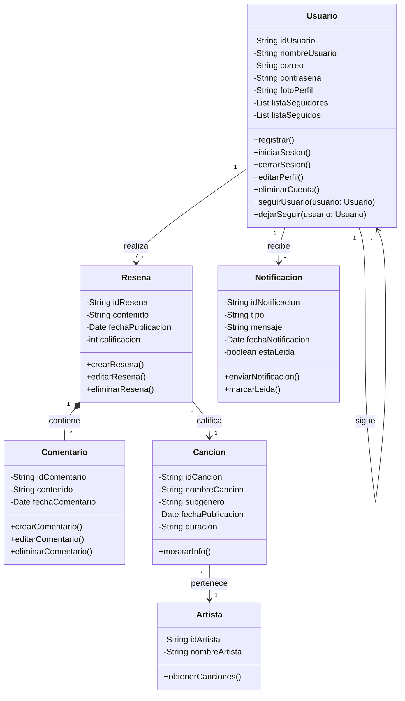
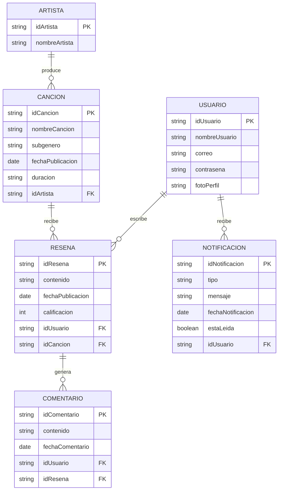

# SOY ( Song Of The Year)

## 📊 Diagrama de Clases

###  Relaciones principales

- Un Usuario puede realizar múltiples Reseñas.
- Una Reseña puede contener múltiples Comentarios.
- Una Reseña califica una Canción.
- Una Canción pertenece a un Artista.
- Un Usuario puede seguir a otros Usuarios.
- Un Usuario puede recibir múltiples Notificaciones.

## 🗄️ Diagrama Entidad - Relación

### 📌 Diferencia entre el Modelo ER y el Diagrama de Clases

El diagrama Entidad–Relación representa la estructura lógica de la base de datos,
incluyendo claves primarias y foráneas necesarias para la persistencia de los datos.

Por otro lado, el diagrama de clases modela la lógica del sistema desde un enfoque
orientado a objetos, representando las entidades del dominio como clases con sus
atributos y métodos, así como sus relaciones.

El modelo ER sirve como base para la implementación del esquema relacional,
mientras que el diagrama de clases es utilizado para el desarrollo del backend
y el mapeo objeto-relacional mediante JPA en Spring Boot.
